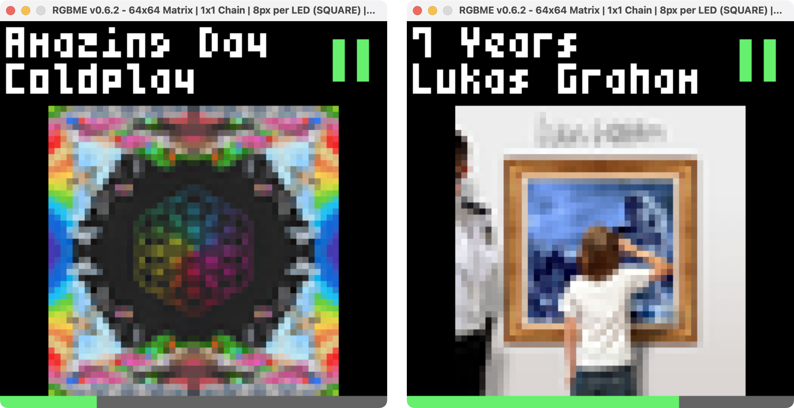
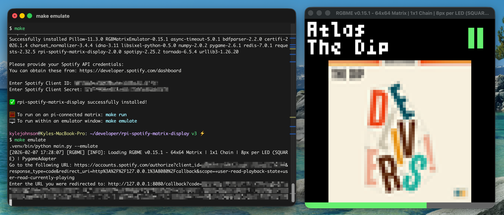
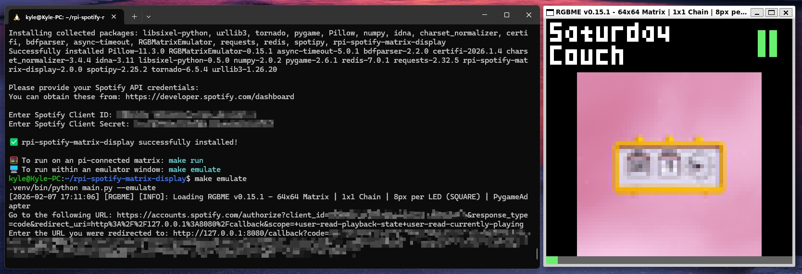

# Raspberry Pi Spotify Matrix Display

A Spotify display for 64x64 RGB LED matrices.

- **🎵 Spotify API Integration** – Show off your currently playing track
- **🖼️ Vibrant Display** – Display album artwork alongside track details or fullscreen
- **🚗 Scrolling Text** – Auto-scrolling text for long track titles and artist names
- **⏯️ Playback Indicators** – Play/pause indicator and track progression bar
- **🖥️ Emulator Support** – Try it out before building your own display!

<br>



## 🔑 Spotify Setup
1. Go to the [Spotify Developer Dashboard](https://developer.spotify.com/dashboard)
2. Create a new app _(name/description can be anything)_
3. Add http://127.0.0.1:8080/callback to Redirect URIs
4. Save and copy the Client ID and Secret for later

## 📦 Installation

```bash
git clone --recurse-submodules https://github.com/kylejohnsonkj/rpi-spotify-matrix-display

cd rpi-spotify-matrix-display

make
```

## ▶ Running the Display

```bash
make run      # Raspberry Pi + matrix display
make emulate  # Emulator window (no hardware required)

make help     # List available commands
```

After running, follow instructions provided in the console. Pasted link should begin with http://127.0.0.1:8080/callback. After successful authorization, play a song and the display will appear!

### macOS


### Windows


## 🛠 Configuration

You can configure Matrix and Spotify settings in `config.ini`. For example, you can change your [hardware mapping](https://github.com/hzeller/rpi-rgb-led-matrix#changing-parameters-via-command-line-flags) (may be required), opt for fullscreen artwork, or set up a device whitelist.

---

### Building Your Own Display

Don't have a Raspberry Pi or RGB matrix yet? No worries! Feel free to mess around with emulation and come back to this section once you're ready.

**Parts List**

- [Adafruit 64x64 RGB LED Matrix - 2.5mm Pitch - 1/32 Scan](https://www.adafruit.com/product/3649)
- [Adafruit RGB Matrix Bonnet for Raspberry Pi](https://www.adafruit.com/product/3211)
- [Raspberry Pi 3B+](https://www.raspberrypi.com/products/raspberry-pi-3-model-b-plus/) (or newer)
- Any microSD card
- [5V 10A Power Supply Adapter](https://www.amazon.com/gp/product/B08HCS1X66)

I also 3d printed a [matrix stand](https://www.thingiverse.com/thing:3781875) and a [pi mount](https://www.thingiverse.com/thing:2732552) for my [own build](https://imgur.com/a/64x64-album-art-matrix-backside-AjrOa5e).

Once you have all the parts, proceed with the Rasperry Pi Setup below!

<details>
<summary><b>Raspberry Pi Setup</b> (click to expand)</summary>

#### Step 1: Install Pi OS
- [Download and open the Raspberry Pi Imager](https://www.raspberrypi.com/software/)
    - Select your Raspberry Pi
    - Select `Raspberry Pi OS (other) - Raspberry Pi OS Lite (64-bit)`
    - Select your microSD card
- Tap "Next" and edit OS customization settings
    - Set hostname (I put matrix), set user/pass (I kept user as pi)
    - Enter wifi credentials
    - Enable ssh using password authentication
- When done, insert microSD card in pi and wait a few min for boot up

#### Step 2: Login via ssh
- `ssh pi@matrix.local`
- This puts you in the `/home/pi` directory
- You can use `pwd` to confirm where you are throughout this process

#### Step 3: Update packages and install git
- `sudo apt update` (get current list of packages)
- `sudo apt upgrade` (upgrade out of date packages)
- `sudo apt install git`

#### Step 4: Jump back to the [Installation](#-installation) instructions above!

#### Step 5: Optimize performance (optional)
- You can run `make rpi-optimize` to try to improve the performance of your display. This will [reserve a CPU core for the display](https://github.com/hzeller/rpi-rgb-led-matrix?tab=readme-ov-file#cpu-use) and [disable onboard audio](https://github.com/hzeller/rpi-rgb-led-matrix?tab=readme-ov-file#troubleshooting).
</details>

https://github.com/user-attachments/assets/9bf163f9-8e0f-47cc-b2d2-a62b3a975471

---

### Acknowledgements
- allenslab for creating the original [matrix-dashboard](https://www.reddit.com/r/3Dprinting/comments/ujyy4g/i_designed_and_3d_printed_a_led_matrix_dashboard/) code and [inspiration](https://www.reddit.com/r/3Dprinting/comments/ujyy4g/i_designed_and_3d_printed_a_led_matrix_dashboard/)
- typorter for his [RGBMatrixEmulator](https://github.com/ty-porter/RGBMatrixEmulator) project (a lifesaver!)
- hzeller for the great [rpi-rgb-led-matrix](https://github.com/hzeller/rpi-rgb-led-matrix) library